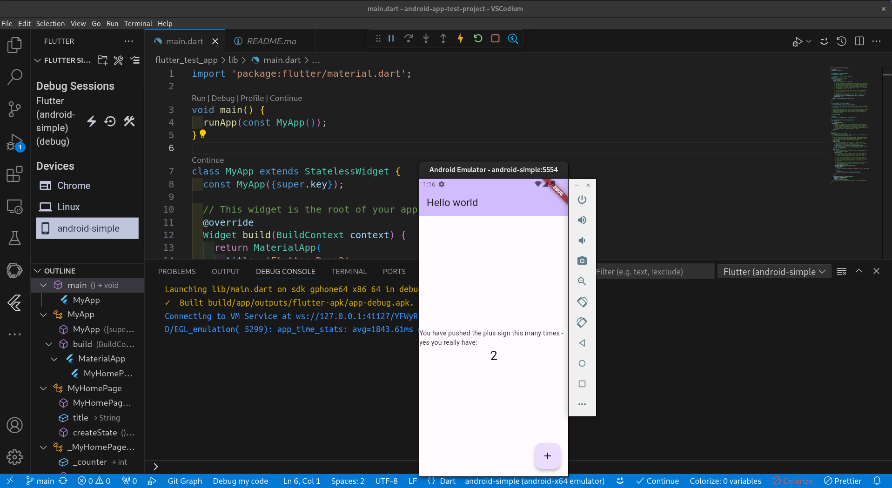
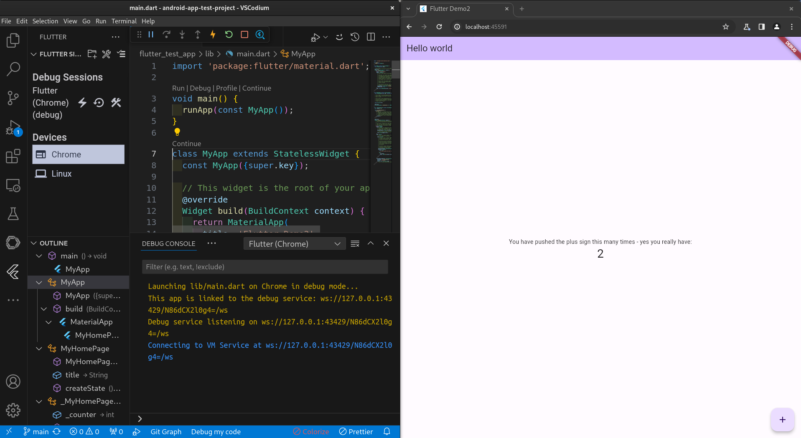
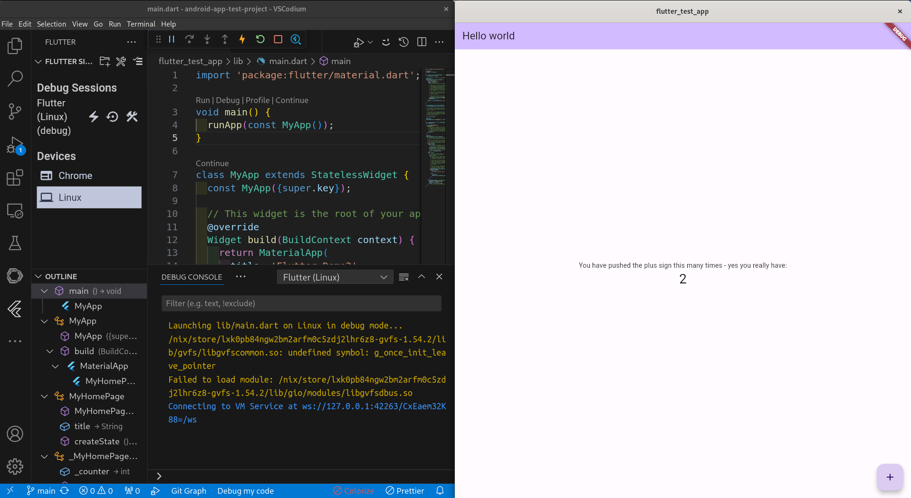

# Flutter environment build using devenv.sh

Thanks to the amazing work from the [devenv.sh](https://devenv.sh/integrations/android/#emulators) team (thanks Domen!) it is now easy to get a good working flutter environment up in NixOS.

With devenv being usable for other OSes (once nix is installed) it could be a low friction approach for other OSes to use too (untested by me).

This environment provides a working light flutter environment that will give you the following result from flutter doctor (as per the current date of writing this [Jul 2024]). What makes the environment light is that it is not using the full Android SDK - but it does have the cmdline-tools etc. for builds and emulators etc.

I tested this from NixOS - but it should work from nix with devenv on other OSes as well.

```bash
➜  flutter git:(main) ✗ flutter doctor   
Doctor summary (to see all details, run flutter doctor -v):
[✓] Flutter (Channel stable, 3.19.0, on NixOS 24.11 (Vicuna) 6.6.41, locale
    en_NZ.UTF-8)
[✓] Android toolchain - develop for Android devices (Android SDK version
    33.0.2)
[✓] Chrome - develop for the web
[✓] Linux toolchain - develop for Linux desktop
[!] Android Studio (not installed)
[✓] Connected device (2 available)
[✓] Network resources

! Doctor found issues in 1 category.

```

For the `flutter doctor -v` output [I captured it here for review](./flutter-doctor-output.md)

For further notes refer to the [devenv.sh](https://devenv.sh/integrations/android/#emulators) and [flutter documentation](https://docs.flutter.dev/)

# When in the instantiated devenv shell

```bash
# create an android emulator
avdmanager create avd -n android-simple -k "system-images;android-32;google_apis_playstore;x86_64"

# run the emulator
emulator -avd android-simple

# enable web if you are going to use flutter for web dev
flutter config --enable-web

# start your editor
codium .
```
## VS code extensions

I used the following 2

- vscode-marketplace.dart-code.flutter
- vscode-marketplace.dart-Code.dart-code

## Once in VS code

Creating a quick "Hello World" Flutter app and checking if your environment is working properly involves a few steps. 

Open VS Code:

1. Ensure you have the Flutter and Dart extensions installed in VS Code.
1. Create a New Flutter Project:
    - Open the Command Palette by pressing Ctrl+Shift+P (Windows/Linux) or Cmd+Shift+P (Mac).
    - Type Flutter: New Project and select it.
    - Choose Application to create a new Flutter application.
    - Select a directory where you want to create the project.
    - Enter a project name, for example, hello_world.
1. Navigate to the Project Directory:
    - edit lib/main.dart
1. Run the App with F5 in debugging:

If everything is set up correctly, your app should launch in the emulator, and you should see a screen with your changes

## What this envionment gives you

Android toolchain installed, you're in a good position for Flutter development. Here's a breakdown of what this means:

1. Toolchain components:

    - Android SDK
    - Android SDK Command-line Tools
    - Platform-tools
    - Build-tools

2. Benefits of your setup:

    - Lighter weight than full Android Studio
    - Sufficient for most Flutter development tasks
    - Allows command-line operations for Android-related tasks

3. What you can do:

    - Develop Flutter apps
    - Build Android APKs
    - Use Android emulators (if installed separately)
    - Perform Android debugging via command line

4. Potential limitations:

    - No graphical interface for Android SDK management
    - Manual updates of Android SDK components
    - Lack of integrated Android-specific IDE features

5. Recommended additional tools:

    - VS Code with Flutter and Dart extensions

This environment is perfect for a more lightweight development environment. Devenv should do a good job at the back end to make sure your toolchain is kept up to date and working with some reasonably good defaults with the latest Flutter versions.

If you do want to have more detailed control change up the devenv.nix file a bit as noted in the [devenv.sh documentation](https://devenv.sh/integrations/android/#emulators)

## Eye candy

### Android dev environment




### Web dev environment




### Linux dev environment


